<h3>ML Engineer · Researcher · MLOps</h3>

Building intelligent systems, experimenting with machine learning, and turning models into reliable software.

 

&nbsp;

&nbsp;

  

&nbsp;&nbsp;&nbsp;

&nbsp;&nbsp;&nbsp;

&nbsp;&nbsp;&nbsp;

# 👨‍💻 About Me

I'm **Shaikh Ubaid Ahmed**, a Computer Science researcher and engineer focused on building **robust, scalable, and production-ready machine learning systems**.

My work sits at the intersection of:

| 🤖 Machine Learning | 👁️ Computer Vision | ⚙️ MLOps | ☁️ Cloud |
|:---:|:---:|:---:|:---:|
| Deep Learning | Object Detection | ML Pipelines | AWS |
| Model Evaluation | Image Processing | Deployment | Azure |
| Adversarial ML | Model Robustness | Docker | Cloud Infrastructure |
| Generative AI | Experimental Research | CI/CD | ML Workloads |

# 🎓 Education

### 🏛️ Indian Institute of Technology Indore

**MS (Research) — Computer Science & Engineering · 2025–Present**

Research interests include **Machine Learning, Computer Vision, Deep Learning, and robust AI systems**.

### 🎓 Lovely Professional University

**B.Tech — Computer Science & Engineering · 2019–2023**

# 💼 Experience

### MLOps Intern — Eaton India

**Pune, India · May 2026 – July 2026**

Worked on production-oriented machine learning infrastructure and pipeline modernization.

- 🔧 Modernized enterprise machine-learning pipelines
- 🏗️ Refactored workflow and data-processing components
- 🚀 Built and validated end-to-end ML workflows
- 🐳 Containerized applications using Docker
- 🔄 Used Git/GitHub for version control
- 🧪 Worked with testing and validation workflows
- 📊 Implemented experiment tracking
- 📚 Improved technical documentation and reproducibility
- 🔬 Worked with simulation-based analysis and data-processing workflows

# 🛠️ Complete Tech Stack

### 🐍 Programming

### 🧠 Machine Learning & Computer Vision

 

### ⚙️ MLOps & Infrastructure

 

### ☁️ Cloud

### 🗄️ Databases

### 🔧 Tools & Platforms

# 🚀 Selected Projects

### 🚦 Traffic Sign Detection & Robustness

Computer-vision research focused on evaluating and improving the reliability of real-time traffic-sign detection systems.

**Focus:**  
`Computer Vision` `Object Detection` `YOLO` `PyTorch` `Adversarial ML`

**Work includes**

- Dataset preparation and conversion
- YOLO-based training
- Adversarial attack evaluation
- Synthetic overlap generation
- Robustness benchmarking
- Detection metric analysis
- Experimental reproducibility

### 🚗 Vehicle Collision Detection

Computer-vision project for identifying potential vehicle collisions using object detection.

**Technologies:**  
`Python` · `OpenCV` · `YOLO` · `Computer Vision`

### 🗺️ Ground Air Navigator

Graph-based navigation and shortest-path project implementing path-planning algorithms.

**Technologies:**  
`Java` · `Data Structures` · `Graph Algorithms` · `Dijkstra`

# 🤖 Exploring Generative AI

| 🧠 LLMs | 🔎 Retrieval | 🗃️ Knowledge | 🤖 Agents |
|:---:|:---:|:---:|:---:|
| Large Language Models | Embeddings | Vector Databases | AI Agents |
| Prompt Engineering | Semantic Search | RAG | Agentic Workflows |
| LLM Applications | Retrieval Pipelines | Knowledge Bases | Tool Use |

 

**Learning Path**

`LLMs` → `Embeddings` → `Vector Search` → `RAG` → `AI Agents` → `Production AI`

# 📚 Currently Learning

| 🐍 Python | ☁️ AWS | 🤖 Generative AI | 🏗️ Software Engineering |
|:---:|:---:|:---:|:---:|
| ML | CLF-C02 | LLMs | DSA |
| MLOps | Cloud Infrastructure | RAG | System Design |
| Automation | Cloud Services | AI Agents | Linux |
| Backend Systems | ML Workloads | Production AI | Distributed Systems |

# 📊 GitHub Analytics

  

# 📈 GitHub Activity

 

&nbsp;

&nbsp;

# 🐍 Contribution Snake

<picture>
  <source media="(prefers-color-scheme: dark)" srcset="https://raw.githubusercontent.com/shaikhubaidahmed/shaikhubaidahmed/output/github-snake-dark.svg">
  <source media="(prefers-color-scheme: light)" srcset="https://raw.githubusercontent.com/shaikhubaidahmed/shaikhubaidahmed/output/github-snake.svg">
  
</picture>

# 🎯 Areas of Interest

| 🤖 AI / ML | 👁️ Computer Vision | ⚙️ MLOps |
|:---:|:---:|:---:|
| Deep Learning | Object Detection | ML Pipelines |
| Generative AI | Image Processing | Deployment |
| RAG | Model Robustness | Docker |
| AI Agents | Adversarial ML | Cloud |

# 🌱 Current Roadmap

| Foundation | ML & Research | Engineering | Next Generation AI |
|:---:|:---:|:---:|:---:|
| 🐍 Python | 🧠 Machine Learning | ⚙️ MLOps | 🤖 GenAI |
| 💻 DSA | 👁️ Computer Vision | ☁️ Cloud | 🔎 RAG |
| 🏗️ System Design | 🔬 Research | 🐳 Deployment | 🧩 AI Agents |

# 🤝 Let's Connect

&nbsp;&nbsp;&nbsp;

&nbsp;&nbsp;&nbsp;

&nbsp;&nbsp;&nbsp;

&nbsp;&nbsp;&nbsp;

  

### ⚡ Build · Learn · Experiment · Ship

